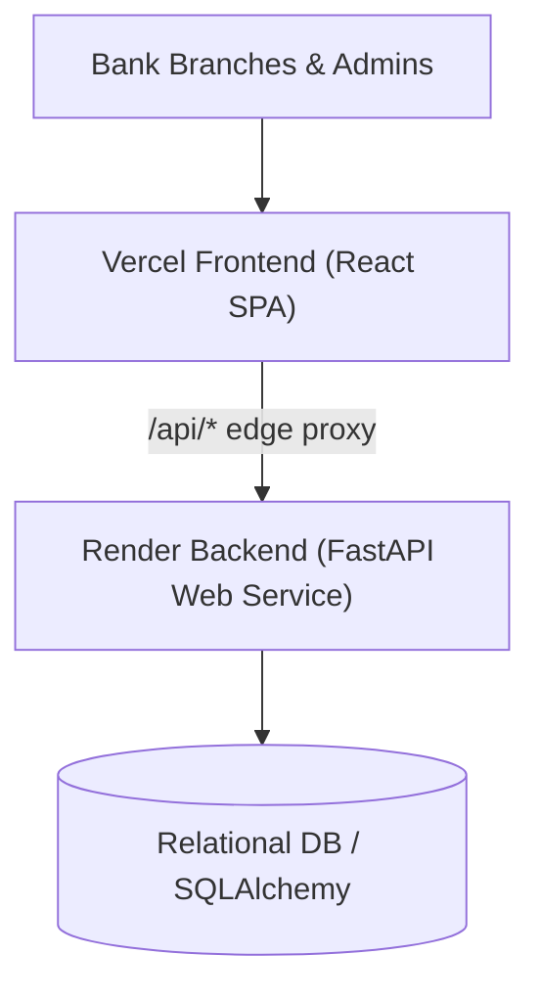

# BankIT360 — Intelligent Branch IT Operations & Monitoring Platform

**RFP Reference:** BIT360/RFP/2026/01  
**Category:** Banking IT Operations / ITSM / Analytics & AI  
**Version:** 1.0.0 (Academic & Enterprise Evaluation Prototype)

---

## 🌟 Executive Summary

BankIT360 is an enterprise-grade, web-based IT operations and monitoring platform engineered specifically for branch-based banking environments. It unifies IT helpdesk service requests, major incident tracking, technology asset management, digitized access workflows, SLA monitoring, branch health scoring, and predictive operational analytics into a single command center.

---

## ✨ Key Features & Capabilities

- 🤖 **AI/ML Ticket Classification (FR-14, Section 13.1):** Real-time TF-IDF Vectorizer + Logistic Regression model predicting category (`Hardware`, `Software`, `Network`, `Access Control`, `ATM & POS Systems`, `Core Banking App`, `Security & Compliance`) and priority from issue text.
- 🏥 **Branch IT Health Index (FR-13, Section 13.3):** Dynamic scoring formula ($0 - 100$) evaluating branch status (**Healthy**, **Moderate Risk**, **Critical Risk**) based on active P1 outages, SLA breaches, failed assets, and recurring issue patterns.
- 🔁 **AI Recurring Issue Hotspot Detector (FR-14, Section 13.2):** Aggregates historical incident patterns across rolling 30-day windows to highlight root cause risks.
- 👥 **Role-Based Access Control (RBAC) & Persona Switcher:** Built-in modal to evaluate views for **Bank Employee**, **IT Support Engineer**, **IT Administrator**, and **IT Manager / Executive**.
- 🎫 **IT Helpdesk & Ticket Lifecycle:** Interactive Kanban Board & Data Table views, conversation history, status updates, and SLA countdowns.
- 🚨 **Major Incident Management:** Severity assessment (P1 Critical - P4 Low), affected services, lead engineer assignment, and Root Cause Analysis (RCA) documentation.
- 💻 **IT Asset Inventory:** Serial number tracking, teller workstations, passbook printers, ATMs, network switches, and warranty expiration alerts.
- 🔐 **Application Access Requests:** 2-Stage approval matrix (Manager Approval -> IT Security Approval -> Automated Access Grant).
- 📊 **Executive Analytics & CSV Exporter:** Recharts charts for volume trends, category distribution, technician throughput, and one-click CSV report export.
- 📜 **Compliance Audit Logs:** Immutable timestamped activity trail logging administrative operations and access approvals.

---

## 🚀 Quick Start Guide

### Frontend Single Page Application (React + Vite + Tailwind CSS)

1. **Install Dependencies:**
   ```bash
   npm install
   ```

2. **Launch Development Server:**
   ```bash
   npm run dev
   ```
   *The application will launch at `http://localhost:5173/`.*

3. **Build Production Bundle:**
   ```bash
   npm run build
   ```

---

## 🐍 Backend Python Service & API Gateway

The backend Python service is located in `backend/`:

1. **Install Backend Dependencies:**
   ```bash
   pip install -r backend/requirements.txt
   ```

2. **Launch FastAPI Application:**
   ```bash
   uvicorn backend.app.main:app --reload --port 8000
   ```
   *API documentation will be available at `http://localhost:8000/docs`.*

3. **Run Pytest Test Suite:**
   ```bash
   pytest backend/tests/test_api.py
   ```

---

## 📁 Repository Structure

```
BankIT360/
├── backend/
│   ├── app/
│   │   ├── main.py                  # FastAPI REST Gateway
│   │   ├── models/domain.py         # SQLAlchemy Models (12 Core Tables)
│   │   └── services/ml_service.py   # TF-IDF Classifier & Pattern Detector
│   ├── tests/
│   │   └── test_api.py              # Pytest Unit Test Suite
│   └── requirements.txt
├── src/
│   ├── main.jsx                     # React Root
│   ├── App.jsx                      # Main Application Orchestrator
│   ├── index.css                    # Design System & Tailwind Styling
│   ├── components/                  # Navbar, Sidebar, Modals, Drawers
│   ├── pages/                       # Dashboard, Tickets, Incidents, Assets, Access, Health, Analytics, SLA, Audit
│   └── services/
│       ├── mockData.js              # Banking Domain Seed Dataset
│       ├── mlEngine.js              # Client-Side AI Classifier & Pattern Engine
│       └── healthEngine.js          # Branch Health Score Calculator
├── package.json
└── vite.config.js
```

---

## ☁️ Cloud Deployment Architecture

BankIT360 is architected for dual-cloud deployment:



### 1. Deploy Frontend to Vercel
The repository includes a ready-to-use [`vercel.json`](./vercel.json) with Vite presets and edge reverse proxying:
1. Go to **[Vercel Dashboard](https://vercel.com/new)**.
2. Select and import **`singhalriya164-commits/BankIT360`**.
3. Framework Preset: **Vite** (auto-detected).
4. Output Directory: **`dist`** (auto-detected).
5. Click **Deploy**. Vercel will build the frontend and route `/api/*` requests to the Render backend service.

### 2. Deploy Backend to Render
The repository includes an Infrastructure-as-Code Blueprint [`render.yaml`](./render.yaml) and [`backend/Dockerfile`](./backend/Dockerfile):
1. Go to **[Render: New Blueprint Instance](https://dashboard.render.com/select-repo?type=blueprint)**.
2. Select your repository: **`singhalriya164-commits/BankIT360`**.
3. Render will detect `render.yaml` and configure:
   - **Service Name**: `bankit360-backend`
   - **Runtime**: Python 3.11
   - **Build Command**: `pip install -r backend/requirements.txt`
   - **Start Command**: `python -m uvicorn backend.app.main:app --host 0.0.0.0 --port $PORT`
   - **Health Check**: `/`
4. Click **Apply** to deploy the live backend web service.

---

## 📄 Documentation Artifacts

- 📋 **Technical Proposal & Implementation Plan:** [implementation_plan.md](https://github.com/singhalriya164-commits/BankIT360)
- 📑 **Walkthrough & Project Deliverables Summary:** [walkthrough.md](https://github.com/singhalriya164-commits/BankIT360)

